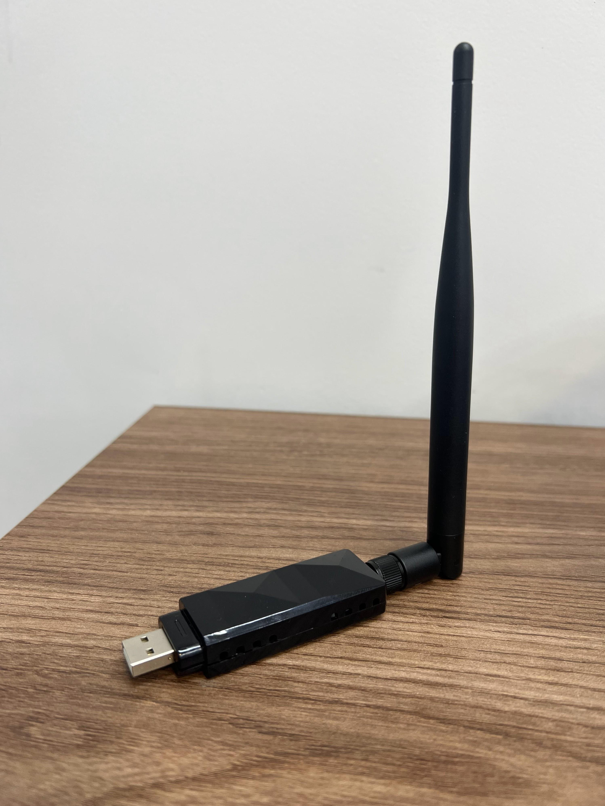
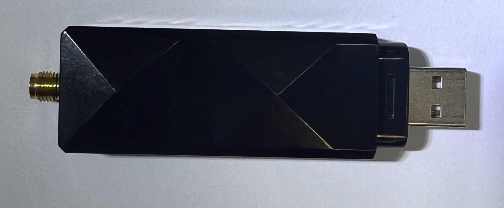
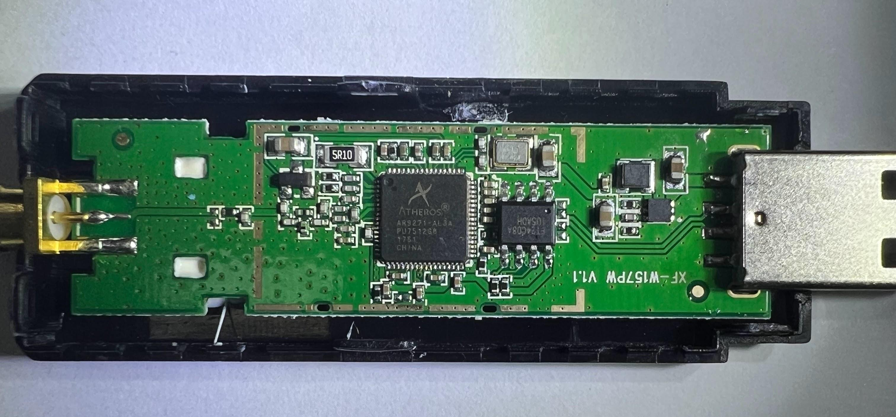

# CHANEVE AR9ESCAPE AR9271

The device is a generic adapter bought from Aliexpress branded as _CHANEVE_.

It came with the usual stock antenna and a CD-ROM containing Windows drivers.

It was automatically recognized by my vanilla MX Linux 21 installation. I was
able to connect to my network without any additional effort.

|                           |                                   |
| ------------------------- | --------------------------------- |
| Chipset                   | AR9271                            |
| IC marking                | `XF-W157PW V1.1`                  |
| lsusb HID                 | `0cf3:9271`                       |
| Monitor mode support?     | Yes, no additional drivers needed |
| Packet injection support? | Yes, no additional driver needed  |

## Summary

- [Environment](#environment)
- [Device images](#device-images)
- [Device information](#device-information)
  - [`lsusb`](#lsusb)
  - [`sudo lsusb -v -d 0cf3:9271`](#sudo-lsusb--v--d-0cf39271)
  - [`sudo iw list`](#sudo-iw-list)
  - [`sudo iw phy1 info`](#sudo-iw-phy1-info)
  - [`sudo dmesg --follow-new`](#sudo-dmesg---follow-new)

## Environment

I'm running the [MX 21.2.1 distro](https://distrowatch.com/table.php?distribution=mx),
which is based on Debian 11.

```shell
$ lsb_release --all
Distributor ID:	Debian
Description:	Debian GNU/Linux 11 (bullseye)
Release:	11
Codename:	bullseye
```

```shell
$ uname -a
Linux mx 5.10.0-20-amd64 #1 SMP Debian 5.10.158-2 (2022-12-13) x86_64 GNU/Linux
```

## Device images

I easily took the device apart by separating the plastic case. No unscrewing
needed.

The only surprise on the teardown is that one face of the PCB is glued to the
adapter case, which makes it impossible to remove the PCB without the risk of
damaging it.

<details>
  <summary>Adapter mounter with the stock antenna</summary>



</details>

<details>
  <summary>External view</summary>



</details>

<details>
  <summary>Inside view</summary>



</details>

## Device information

### `lsusb`

```shell
$ lsusb
Bus 001 Device 004: ID 0cf3:9271 Qualcomm Atheros Communications AR9271 802.11n
```

### `sudo lsusb -v -d 0cf3:9271`

```shell
$ sudo lsusb -v -d 0cf3:9271
Bus 001 Device 004: ID 0cf3:9271 Qualcomm Atheros Communications AR9271 802.11n
Device Descriptor:
  bLength                18
  bDescriptorType         1
  bcdUSB               2.00
  bDeviceClass          255 Vendor Specific Class
  bDeviceSubClass       255 Vendor Specific Subclass
  bDeviceProtocol       255 Vendor Specific Protocol
  bMaxPacketSize0        64
  idVendor           0x0cf3 Qualcomm Atheros Communications
  idProduct          0x9271 AR9271 802.11n
  bcdDevice            1.08
  iManufacturer          16 ATHEROS
  iProduct               32 UB93
  iSerial                48 12345
  bNumConfigurations      1
  Configuration Descriptor:
    bLength                 9
    bDescriptorType         2
    wTotalLength       0x003c
    bNumInterfaces          1
    bConfigurationValue     1
    iConfiguration          0 
    bmAttributes         0x80
      (Bus Powered)
    MaxPower              500mA
    Interface Descriptor:
      bLength                 9
      bDescriptorType         4
      bInterfaceNumber        0
      bAlternateSetting       0
      bNumEndpoints           6
      bInterfaceClass       255 Vendor Specific Class
      bInterfaceSubClass      0 
      bInterfaceProtocol      0 
      iInterface              0 
      Endpoint Descriptor:
        bLength                 7
        bDescriptorType         5
        bEndpointAddress     0x01  EP 1 OUT
        bmAttributes            2
          Transfer Type            Bulk
          Synch Type               None
          Usage Type               Data
        wMaxPacketSize     0x0200  1x 512 bytes
        bInterval               0
      Endpoint Descriptor:
        bLength                 7
        bDescriptorType         5
        bEndpointAddress     0x82  EP 2 IN
        bmAttributes            2
          Transfer Type            Bulk
          Synch Type               None
          Usage Type               Data
        wMaxPacketSize     0x0200  1x 512 bytes
        bInterval               0
      Endpoint Descriptor:
        bLength                 7
        bDescriptorType         5
        bEndpointAddress     0x83  EP 3 IN
        bmAttributes            3
          Transfer Type            Interrupt
          Synch Type               None
          Usage Type               Data
        wMaxPacketSize     0x0040  1x 64 bytes
        bInterval               1
      Endpoint Descriptor:
        bLength                 7
        bDescriptorType         5
        bEndpointAddress     0x04  EP 4 OUT
        bmAttributes            3
          Transfer Type            Interrupt
          Synch Type               None
          Usage Type               Data
        wMaxPacketSize     0x0040  1x 64 bytes
        bInterval               1
      Endpoint Descriptor:
        bLength                 7
        bDescriptorType         5
        bEndpointAddress     0x05  EP 5 OUT
        bmAttributes            2
          Transfer Type            Bulk
          Synch Type               None
          Usage Type               Data
        wMaxPacketSize     0x0200  1x 512 bytes
        bInterval               0
      Endpoint Descriptor:
        bLength                 7
        bDescriptorType         5
        bEndpointAddress     0x06  EP 6 OUT
        bmAttributes            2
          Transfer Type            Bulk
          Synch Type               None
          Usage Type               Data
        wMaxPacketSize     0x0200  1x 512 bytes
        bInterval               0
Device Qualifier (for other device speed):
  bLength                10
  bDescriptorType         6
  bcdUSB               2.00
  bDeviceClass          255 Vendor Specific Class
  bDeviceSubClass       255 Vendor Specific Subclass
  bDeviceProtocol       255 Vendor Specific Protocol
  bMaxPacketSize0        64
  bNumConfigurations      1
Device Status:     0x0000
  (Bus Powered)
 
```

### `sudo iw list`

```shell
$ sudo iw list
Wiphy phy1
	wiphy index: 1
	max # scan SSIDs: 4
	max scan IEs length: 2257 bytes
	max # sched scan SSIDs: 0
	max # match sets: 0
	Retry short limit: 7
	Retry long limit: 4
	Coverage class: 0 (up to 0m)
	Device supports RSN-IBSS.
	Device supports T-DLS.
	Supported Ciphers:
		* WEP40 (00-0f-ac:1)
		* WEP104 (00-0f-ac:5)
		* TKIP (00-0f-ac:2)
		* CCMP-128 (00-0f-ac:4)
		* CCMP-256 (00-0f-ac:10)
		* GCMP-128 (00-0f-ac:8)
		* GCMP-256 (00-0f-ac:9)
		* CMAC (00-0f-ac:6)
		* CMAC-256 (00-0f-ac:13)
		* GMAC-128 (00-0f-ac:11)
		* GMAC-256 (00-0f-ac:12)
	Available Antennas: TX 0x1 RX 0x1
	Configured Antennas: TX 0x1 RX 0x1
	Supported interface modes:
		 * IBSS
		 * managed
		 * AP
		 * AP/VLAN
		 * monitor
		 * mesh point
		 * P2P-client
		 * P2P-GO
		 * outside context of a BSS
	Band 1:
		Capabilities: 0x116e
			HT20/HT40
			SM Power Save disabled
			RX HT20 SGI
			RX HT40 SGI
			RX STBC 1-stream
			Max AMSDU length: 3839 bytes
			DSSS/CCK HT40
		Maximum RX AMPDU length 65535 bytes (exponent: 0x003)
		Minimum RX AMPDU time spacing: 8 usec (0x06)
		HT TX/RX MCS rate indexes supported: 0-7
		Bitrates (non-HT):
			* 1.0 Mbps
			* 2.0 Mbps (short preamble supported)
			* 5.5 Mbps (short preamble supported)
			* 11.0 Mbps (short preamble supported)
			* 6.0 Mbps
			* 9.0 Mbps
			* 12.0 Mbps
			* 18.0 Mbps
			* 24.0 Mbps
			* 36.0 Mbps
			* 48.0 Mbps
			* 54.0 Mbps
		Frequencies:
			* 2412 MHz [1] (30.0 dBm)
			* 2417 MHz [2] (30.0 dBm)
			* 2422 MHz [3] (30.0 dBm)
			* 2427 MHz [4] (30.0 dBm)
			* 2432 MHz [5] (30.0 dBm)
			* 2437 MHz [6] (30.0 dBm)
			* 2442 MHz [7] (30.0 dBm)
			* 2447 MHz [8] (30.0 dBm)
			* 2452 MHz [9] (30.0 dBm)
			* 2457 MHz [10] (30.0 dBm)
			* 2462 MHz [11] (30.0 dBm)
			* 2467 MHz [12] (disabled)
			* 2472 MHz [13] (disabled)
			* 2484 MHz [14] (disabled)
	Supported commands:
		 * new_interface
		 * set_interface
		 * new_key
		 * start_ap
		 * new_station
		 * new_mpath
		 * set_mesh_config
		 * set_bss
		 * authenticate
		 * associate
		 * deauthenticate
		 * disassociate
		 * join_ibss
		 * join_mesh
		 * remain_on_channel
		 * set_tx_bitrate_mask
		 * frame
		 * frame_wait_cancel
		 * set_wiphy_netns
		 * set_channel
		 * set_wds_peer
		 * tdls_mgmt
		 * tdls_oper
		 * probe_client
		 * set_noack_map
		 * register_beacons
		 * start_p2p_device
		 * set_mcast_rate
		 * connect
		 * disconnect
		 * channel_switch
		 * set_qos_map
		 * set_multicast_to_unicast
	software interface modes (can always be added):
		 * AP/VLAN
		 * monitor
	valid interface combinations:
		 * #{ managed, P2P-client } <= 2, #{ AP, mesh point, P2P-GO } <= 2,
		   total <= 2, #channels <= 1
	HT Capability overrides:
		 * MCS: ff ff ff ff ff ff ff ff ff ff
		 * maximum A-MSDU length
		 * supported channel width
		 * short GI for 40 MHz
		 * max A-MPDU length exponent
		 * min MPDU start spacing
	Device supports TX status socket option.
	Device supports HT-IBSS.
	Device supports SAE with AUTHENTICATE command
	Device supports low priority scan.
	Device supports scan flush.
	Device supports AP scan.
	Device supports per-vif TX power setting
	Driver supports full state transitions for AP/GO clients
	Driver supports a userspace MPM
	Device supports configuring vdev MAC-addr on create.
	max # scan plans: 1
	max scan plan interval: -1
	max scan plan iterations: 0
	Supported TX frame types:
		 * IBSS: 0x00 0x10 0x20 0x30 0x40 0x50 0x60 0x70 0x80 0x90 0xa0 0xb0 0xc0 0xd0 0xe0 0xf0
		 * managed: 0x00 0x10 0x20 0x30 0x40 0x50 0x60 0x70 0x80 0x90 0xa0 0xb0 0xc0 0xd0 0xe0 0xf0
		 * AP: 0x00 0x10 0x20 0x30 0x40 0x50 0x60 0x70 0x80 0x90 0xa0 0xb0 0xc0 0xd0 0xe0 0xf0
		 * AP/VLAN: 0x00 0x10 0x20 0x30 0x40 0x50 0x60 0x70 0x80 0x90 0xa0 0xb0 0xc0 0xd0 0xe0 0xf0
		 * mesh point: 0x00 0x10 0x20 0x30 0x40 0x50 0x60 0x70 0x80 0x90 0xa0 0xb0 0xc0 0xd0 0xe0 0xf0
		 * P2P-client: 0x00 0x10 0x20 0x30 0x40 0x50 0x60 0x70 0x80 0x90 0xa0 0xb0 0xc0 0xd0 0xe0 0xf0
		 * P2P-GO: 0x00 0x10 0x20 0x30 0x40 0x50 0x60 0x70 0x80 0x90 0xa0 0xb0 0xc0 0xd0 0xe0 0xf0
		 * P2P-device: 0x00 0x10 0x20 0x30 0x40 0x50 0x60 0x70 0x80 0x90 0xa0 0xb0 0xc0 0xd0 0xe0 0xf0
	Supported RX frame types:
		 * IBSS: 0x40 0xb0 0xc0 0xd0
		 * managed: 0x40 0xb0 0xd0
		 * AP: 0x00 0x20 0x40 0xa0 0xb0 0xc0 0xd0
		 * AP/VLAN: 0x00 0x20 0x40 0xa0 0xb0 0xc0 0xd0
		 * mesh point: 0xb0 0xc0 0xd0
		 * P2P-client: 0x40 0xd0
		 * P2P-GO: 0x00 0x20 0x40 0xa0 0xb0 0xc0 0xd0
		 * P2P-device: 0x40 0xd0
	Supported extended features:
		* [ RRM ]: RRM
		* [ FILS_STA ]: STA FILS (Fast Initial Link Setup)
		* [ CQM_RSSI_LIST ]: multiple CQM_RSSI_THOLD records
		* [ CONTROL_PORT_OVER_NL80211 ]: control port over nl80211
		* [ SCAN_RANDOM_SN ]: use random sequence numbers in scans
		* [ SCAN_MIN_PREQ_CONTENT ]: use probe request with only rate IEs in scans
		* [ CONTROL_PORT_NO_PREAUTH ]: disable pre-auth over nl80211 control port support
		* [ DEL_IBSS_STA ]: deletion of IBSS station support
		* [ MULTICAST_REGISTRATIONS ]: mgmt frame registration for multicast
		* [ SCAN_FREQ_KHZ ]: scan on kHz frequency support
		* [ CONTROL_PORT_OVER_NL80211_TX_STATUS ]: tx status for nl80211 control port support
```

### `sudo iw phy1 info`

```shell
$ sudo iw phy1 info
Wiphy phy1
	wiphy index: 1
	max # scan SSIDs: 4
	max scan IEs length: 2257 bytes
	max # sched scan SSIDs: 0
	max # match sets: 0
	Retry short limit: 7
	Retry long limit: 4
	Coverage class: 0 (up to 0m)
	Device supports RSN-IBSS.
	Device supports T-DLS.
	Supported Ciphers:
		* WEP40 (00-0f-ac:1)
		* WEP104 (00-0f-ac:5)
		* TKIP (00-0f-ac:2)
		* CCMP-128 (00-0f-ac:4)
		* CCMP-256 (00-0f-ac:10)
		* GCMP-128 (00-0f-ac:8)
		* GCMP-256 (00-0f-ac:9)
		* CMAC (00-0f-ac:6)
		* CMAC-256 (00-0f-ac:13)
		* GMAC-128 (00-0f-ac:11)
		* GMAC-256 (00-0f-ac:12)
	Available Antennas: TX 0x1 RX 0x1
	Configured Antennas: TX 0x1 RX 0x1
	Supported interface modes:
		 * IBSS
		 * managed
		 * AP
		 * AP/VLAN
		 * monitor
		 * mesh point
		 * P2P-client
		 * P2P-GO
		 * outside context of a BSS
	Band 1:
		Capabilities: 0x116e
			HT20/HT40
			SM Power Save disabled
			RX HT20 SGI
			RX HT40 SGI
			RX STBC 1-stream
			Max AMSDU length: 3839 bytes
			DSSS/CCK HT40
		Maximum RX AMPDU length 65535 bytes (exponent: 0x003)
		Minimum RX AMPDU time spacing: 8 usec (0x06)
		HT TX/RX MCS rate indexes supported: 0-7
		Bitrates (non-HT):
			* 1.0 Mbps
			* 2.0 Mbps (short preamble supported)
			* 5.5 Mbps (short preamble supported)
			* 11.0 Mbps (short preamble supported)
			* 6.0 Mbps
			* 9.0 Mbps
			* 12.0 Mbps
			* 18.0 Mbps
			* 24.0 Mbps
			* 36.0 Mbps
			* 48.0 Mbps
			* 54.0 Mbps
		Frequencies:
			* 2412 MHz [1] (30.0 dBm)
			* 2417 MHz [2] (30.0 dBm)
			* 2422 MHz [3] (30.0 dBm)
			* 2427 MHz [4] (30.0 dBm)
			* 2432 MHz [5] (30.0 dBm)
			* 2437 MHz [6] (30.0 dBm)
			* 2442 MHz [7] (30.0 dBm)
			* 2447 MHz [8] (30.0 dBm)
			* 2452 MHz [9] (30.0 dBm)
			* 2457 MHz [10] (30.0 dBm)
			* 2462 MHz [11] (30.0 dBm)
			* 2467 MHz [12] (disabled)
			* 2472 MHz [13] (disabled)
			* 2484 MHz [14] (disabled)
	Supported commands:
		 * new_interface
		 * set_interface
		 * new_key
		 * start_ap
		 * new_station
		 * new_mpath
		 * set_mesh_config
		 * set_bss
		 * authenticate
		 * associate
		 * deauthenticate
		 * disassociate
		 * join_ibss
		 * join_mesh
		 * remain_on_channel
		 * set_tx_bitrate_mask
		 * frame
		 * frame_wait_cancel
		 * set_wiphy_netns
		 * set_channel
		 * set_wds_peer
		 * tdls_mgmt
		 * tdls_oper
		 * probe_client
		 * set_noack_map
		 * register_beacons
		 * start_p2p_device
		 * set_mcast_rate
		 * connect
		 * disconnect
		 * channel_switch
		 * set_qos_map
		 * set_multicast_to_unicast
	software interface modes (can always be added):
		 * AP/VLAN
		 * monitor
	valid interface combinations:
		 * #{ managed, P2P-client } <= 2, #{ AP, mesh point, P2P-GO } <= 2,
		   total <= 2, #channels <= 1
	HT Capability overrides:
		 * MCS: ff ff ff ff ff ff ff ff ff ff
		 * maximum A-MSDU length
		 * supported channel width
		 * short GI for 40 MHz
		 * max A-MPDU length exponent
		 * min MPDU start spacing
	Device supports TX status socket option.
	Device supports HT-IBSS.
	Device supports SAE with AUTHENTICATE command
	Device supports low priority scan.
	Device supports scan flush.
	Device supports AP scan.
	Device supports per-vif TX power setting
	Driver supports full state transitions for AP/GO clients
	Driver supports a userspace MPM
	Device supports configuring vdev MAC-addr on create.
	max # scan plans: 1
	max scan plan interval: -1
	max scan plan iterations: 0
	Supported TX frame types:
		 * IBSS: 0x00 0x10 0x20 0x30 0x40 0x50 0x60 0x70 0x80 0x90 0xa0 0xb0 0xc0 0xd0 0xe0 0xf0
		 * managed: 0x00 0x10 0x20 0x30 0x40 0x50 0x60 0x70 0x80 0x90 0xa0 0xb0 0xc0 0xd0 0xe0 0xf0
		 * AP: 0x00 0x10 0x20 0x30 0x40 0x50 0x60 0x70 0x80 0x90 0xa0 0xb0 0xc0 0xd0 0xe0 0xf0
		 * AP/VLAN: 0x00 0x10 0x20 0x30 0x40 0x50 0x60 0x70 0x80 0x90 0xa0 0xb0 0xc0 0xd0 0xe0 0xf0
		 * mesh point: 0x00 0x10 0x20 0x30 0x40 0x50 0x60 0x70 0x80 0x90 0xa0 0xb0 0xc0 0xd0 0xe0 0xf0
		 * P2P-client: 0x00 0x10 0x20 0x30 0x40 0x50 0x60 0x70 0x80 0x90 0xa0 0xb0 0xc0 0xd0 0xe0 0xf0
		 * P2P-GO: 0x00 0x10 0x20 0x30 0x40 0x50 0x60 0x70 0x80 0x90 0xa0 0xb0 0xc0 0xd0 0xe0 0xf0
		 * P2P-device: 0x00 0x10 0x20 0x30 0x40 0x50 0x60 0x70 0x80 0x90 0xa0 0xb0 0xc0 0xd0 0xe0 0xf0
	Supported RX frame types:
		 * IBSS: 0x40 0xb0 0xc0 0xd0
		 * managed: 0x40 0xb0 0xd0
		 * AP: 0x00 0x20 0x40 0xa0 0xb0 0xc0 0xd0
		 * AP/VLAN: 0x00 0x20 0x40 0xa0 0xb0 0xc0 0xd0
		 * mesh point: 0xb0 0xc0 0xd0
		 * P2P-client: 0x40 0xd0
		 * P2P-GO: 0x00 0x20 0x40 0xa0 0xb0 0xc0 0xd0
		 * P2P-device: 0x40 0xd0
	Supported extended features:
		* [ RRM ]: RRM
		* [ FILS_STA ]: STA FILS (Fast Initial Link Setup)
		* [ CQM_RSSI_LIST ]: multiple CQM_RSSI_THOLD records
		* [ CONTROL_PORT_OVER_NL80211 ]: control port over nl80211
		* [ SCAN_RANDOM_SN ]: use random sequence numbers in scans
		* [ SCAN_MIN_PREQ_CONTENT ]: use probe request with only rate IEs in scans
		* [ CONTROL_PORT_NO_PREAUTH ]: disable pre-auth over nl80211 control port support
		* [ DEL_IBSS_STA ]: deletion of IBSS station support
		* [ MULTICAST_REGISTRATIONS ]: mgmt frame registration for multicast
		* [ SCAN_FREQ_KHZ ]: scan on kHz frequency support
		* [ CONTROL_PORT_OVER_NL80211_TX_STATUS ]: tx status for nl80211 control port support
```

### `sudo dmesg --follow-new`

```
$ sudo dmesg --follow-new
[   61.791147] usb 1-3: new high-speed USB device number 4 using xhci_hcd
[   61.959936] usb 1-3: New USB device found, idVendor=0cf3, idProduct=9271, bcdDevice= 1.08
[   61.959946] usb 1-3: New USB device strings: Mfr=16, Product=32, SerialNumber=48
[   61.959951] usb 1-3: Product: UB93
[   61.959955] usb 1-3: Manufacturer: ATHEROS
[   61.959958] usb 1-3: SerialNumber: 12345
[   62.542021] usb 1-3: ath9k_htc: Firmware ath9k_htc/htc_9271-1.dev.0.fw requested
[   62.542161] usbcore: registered new interface driver ath9k_htc
[   62.543106] usb 1-3: firmware: direct-loading firmware ath9k_htc/htc_9271-1.dev.0.fw
[   62.829381] usb 1-3: ath9k_htc: Transferred FW: ath9k_htc/htc_9271-1.dev.0.fw, size: 51008
[   63.078333] ath9k_htc 1-3:1.0: ath9k_htc: HTC initialized with 33 credits
[   63.350450] ath9k_htc 1-3:1.0: ath9k_htc: FW Version: 1.4
[   63.350452] ath9k_htc 1-3:1.0: FW RMW support: On
[   63.350453] ath: EEPROM regdomain: 0x60
[   63.350453] ath: EEPROM indicates we should expect a direct regpair map
[   63.350454] ath: Country alpha2 being used: 00
[   63.350455] ath: Regpair used: 0x60
[   63.354836] ath: EEPROM regdomain: 0x8348
[   63.354836] ath: EEPROM indicates we should expect a country code
[   63.354837] ath: doing EEPROM country->regdmn map search
[   63.354838] ath: country maps to regdmn code: 0x3a
[   63.354838] ath: Country alpha2 being used: US
[   63.354839] ath: Regpair used: 0x3a
[   63.354840] ath: regdomain 0x8348 dynamically updated by country element
[   63.355117] ieee80211 phy1: Atheros AR9271 Rev:1
```
